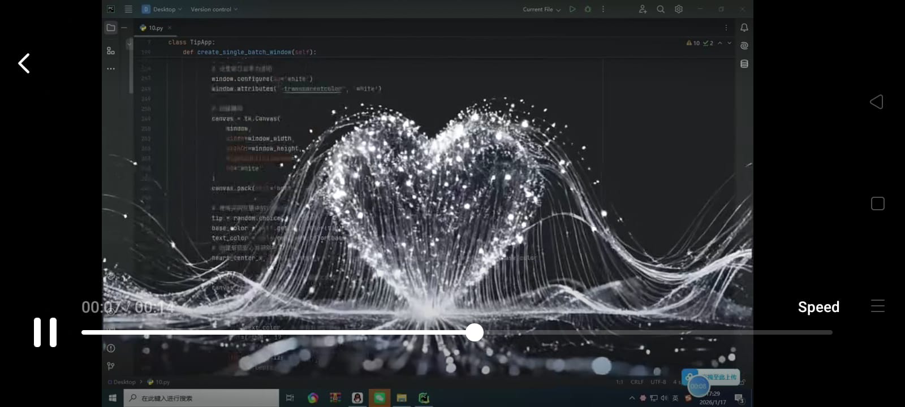
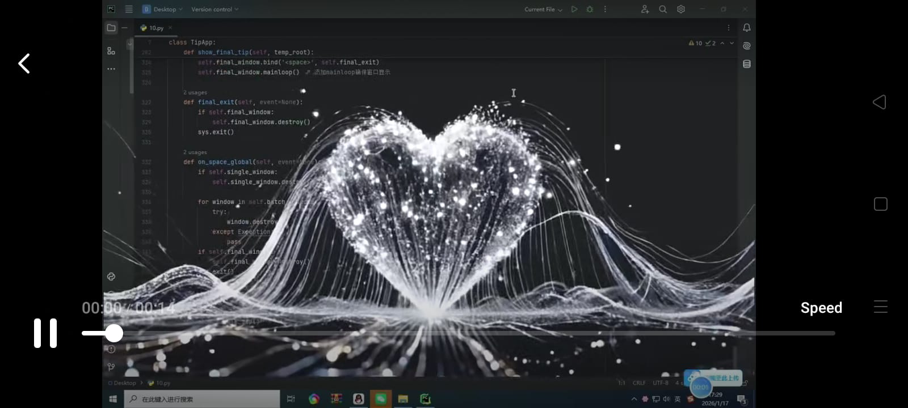
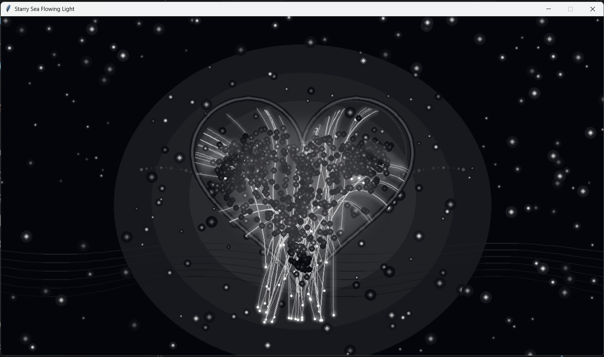
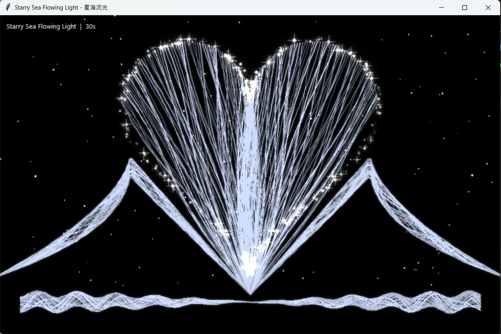

# ✨ Starry Sea Flowing Light

A visually captivating Python animation inspired by the popular **"Starry Sea Flowing Light (星海流光)"** effect. This project recreates a glowing heart formed by animated light trails, shimmering particles, and dynamic bloom using **Tkinter**, **Pillow**, and **NumPy**.

---

## 📸 Preview

| Animation | Animation |
|-----------|-----------|
|  |  |
|  |  |

> Replace the images above with your own screenshots by creating a `screenshots/` folder in the repository.

---

## ✨ Features

- ❤️ Animated mathematical heart curve
- 🌊 Flowing light strand animation
- ✨ Dynamic sparkling particle effects
- 🌌 Twinkling background stars
- 💫 Multi-layer glow and bloom rendering
- 🎞️ Smooth real-time animation using Tkinter
- 🎨 Pure Python implementation (no OpenGL or Pygame)

---

## 📂 Project Structure

```text
Starry-Sea-Flowing-Light/
│
├── output/                     # Exported animations or renders
├── venv/                       # Virtual environment (optional)
│
├── config.py                   # Global configuration
├── heart.py                    # Heart geometry and math
├── particle.py                 # Particle system
├── stars.py                    # Background stars
├── tkinter_starry_heart.py     # Main animation implementation
├── tkinkter.py                 # Alternate implementation
├── main.py                     # Entry point
│
├── Animation1.jpeg
├── Animation2.jpeg
│
├── requirements.txt
├── README.md
└── .gitignore
```

---

## 🚀 Installation

Clone the repository:

```bash
git clone https://github.com/raahim27-hash/Shiny-Star-Tkinter.git
cd Shiny-Star-Tkinter-Project
```

Install the required packages:

```bash
pip install -r requirements.txt
```

---

## ▶️ Run

Launch the animation:

```bash
python main.py
```

Or run the standalone animation:

```bash
python tkinkter.py
```

Or run this standalone animation:

```bash
python tkinter_starry_heart.py
```

---

## 🛠️ Technologies Used

- Python 3.x
- Tkinter
- Pillow (PIL)
- NumPy

---

## 📦 Dependencies

```
Pillow
NumPy
```

or simply install everything with:

```bash
pip install -r requirements.txt
```

---

## 🎯 Inspiration

This project is inspired by the popular **Starry Sea Flowing Light (星海流光)** visual effect seen across TikTok and Douyin. It demonstrates how mathematical curves, procedural animation, particles, and image processing techniques can be combined to create visually appealing real-time effects using pure Python.

---

## 📈 Future Improvements

- Higher performance rendering
- GPU/OpenGL implementation
- Video export support
- Additional particle effects
- Interactive controls
- Custom color themes
- Adjustable animation parameters

---

## 📄 License

This project is released under the MIT License.

---

## 👨‍💻 Author

Developed with ❤️ using Python.